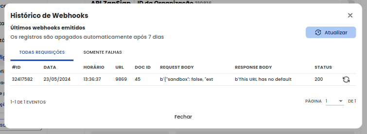

# Logs de Webhooks

Entendemos que lidar com webhooks de terceiros pode ser complicado, especialmente na hora de depurar eventuais problemas. Para facilitar esse processo, você pode **acompanhar todos os webhooks enviados nos últimos 7 dias** dentro da sua conta!

Para acessar, **Configurações>Integrações>Api ZapSign>webhooks>** [**Logs Webhooks** ](https://app.zapsign.com.br/conta/configuracoes/integration?tab=api-zapsign).


**Está vendo webhooks repetidos?** Sempre que a sua aplicação retornar um **status diferente de 200**, a ZapSign irá tentar enviar o webhook mais de uma vez.


