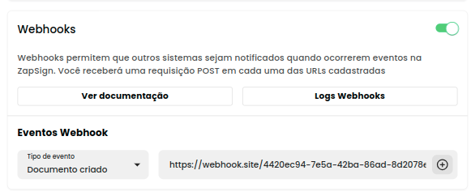

# Testando Webhooks

Para facilitar o teste de webhooks sem precisar configurar um servidor local, ferramentas como **Webhook Site** são uma ótima opção. Elas permitem que você capture e visualize eventos recebidos pela API de forma rápida, ajudando na depuração e validação dos webhooks em tempo real. Confira como testar seus webhooks utilizando o webhook.site!

***

\
<mark style="background-color:blue;">1.</mark> <mark style="background-color:blue;"></mark><mark style="background-color:blue;">**Criando um Webhook no Webhook.site**</mark>

**Passo 1**: Acesse [Webhook.site](https://webhook.site/).

**Passo 2**: Na página inicial, você verá um URL exclusivo gerado automaticamenteEste será o seu **endpoint** para receber os webhooks.

**Passo 3**: Deixe essa aba aberta, pois é aqui que você visualizará os dados que serão enviados pelo webhook da ZapSign.

#### <mark style="background-color:blue;">2.</mark> <mark style="background-color:blue;"></mark><mark style="background-color:blue;">**Configurando o Webhook na ZapSign**</mark>

**Passo 1**: Acesse a ZapSign via ambiente de [produção](https://app.zapsign.com.br/acesso/criar-conta?hsCtaTracking=086cae81-8879-4c9a-9f6b-5cf5fc731497%7C9c90b543-ffd8-47b8-8638-df33d77e9653) ou [Sandbox](https://sandbox.app.zapsign.com.br/acesso/entrar)

**Passo 2**: Navegue até a área de **Configurações>Integrações>Api ZapSign>** [**Webhooks** ](https://app.zapsign.com.br/conta/configuracoes/integration?tab=api-zapsign)

**Passo 3**: Adicione o URL gerado pelo Webhook.site  no campo onde a ZapSign solicita o **endpoint** para os webhooks.&#x20;

**Passo 4**: Defina os eventos para os quais deseja receber webhooks, como "Documento Criado", "Documento Assinado", "Email Bounce", etc. e clique no "+" para adicionar o endereço.

<figure><figcaption>
Você pode cadastrar quantos webhooks quiser.
</figcaption></figure>

#### <mark style="background-color:blue;">3.</mark> <mark style="background-color:blue;"></mark><mark style="background-color:blue;">**Gerando um Evento na ZapSign**</mark>

Agora que o webhook está configurado, você precisa gerar um evento que dispare o webhook.

Crie um documento ou acione um evento na ZapSign e verifique o Webhook.site para a requisição POST recebida, que conterá todos os detalhes do evento, como ID do documento, status e payload.\

<figure><figcaption>
Confira todos o detalhes enviados pela ZapSign.
</figcaption></figure>

No próximo capítulo, veremos mais detalhes de como[ Criar webhooks](criar-webhook.md), via interface web e api.
